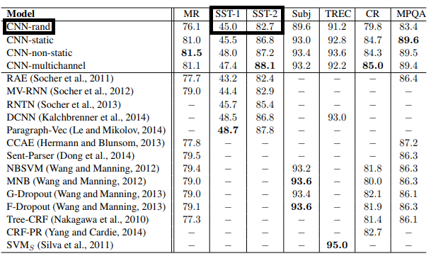
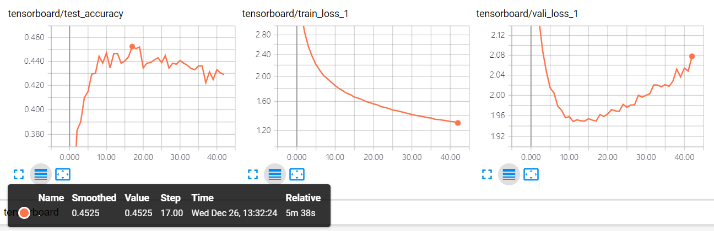
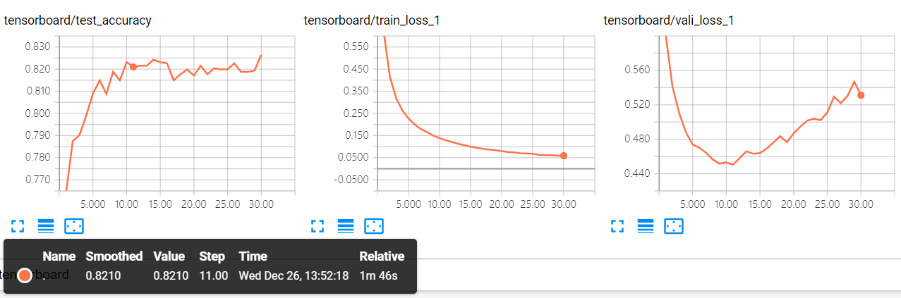

# TensorFlow-TextCNN
TextCNN (Convolutional Neural Networks for Sentence Classification - Yoon Kim)

## dataset
   * SST(Stanford Sentiment Treebank)
      * http://nlp.stanford.edu/~socherr/stanfordSentimentTreebank.zip
      * pre-processed data
         * https://github.com/singhalprerana/SST_data_extraction
            * sst_train_sentence.csv
            * sst_train_phrases.csv
            * sst_dev.csv
            * sst_test.csv
   
   
## Result (metric: Accuracy)
   * paper result  
     
   * SST1 result   
     
   * SST2 result   
     
